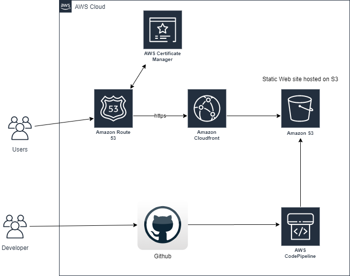

# Deploying static website in AWS through CI/CD pipeline using Github and AWS CodePipeline, S3, and CloudFront

Hosting website that is not only dynamic but also scalable and reliable is crucial. Amazon Web Services (AWS) offers a robust infrastructure for hosting websites of any scale, and when combined with Continuous Integration/Continuous Deployment (CI/CD) pipelines, it becomes a powerful tool for automating deployment processes.

## Overview

In this project, you will create a continuous delivery pipeline for a static web application hosted on Amazon S3 for storage and AWS CloudFront for content delivery to automate the deployment process, ensuring that updates to our website are delivered seamlessly to users. A provided index.htlm file that contains the codes will be used in the project.

### Application architecture

- The following diagram provides a visual representation of the services used in this tutorial and how they are connected. This application uses GitHub, AWS S3, CloudFront, Route 53, and AWS CodePipeline.

As we go through this project, we will discuss the services in detail and point to resources that will help you get up to speed with them.

DNS services is crucial for directing users to your website, and ensuring proper configuration and strengthening account security with robust authentication methods like multi-factor authentication (MFA) is essential.

Leveraging CloudFront as a Content Delivery Network (CDN) enhances website performance and reliability, with CloudFront configured to access the S3 bucket exclusively through an Origin Access Identity (OAI), adhering to the principle of least privilege and bolstering security.

Enforcing HTTPS with ACM certificates ensures encrypted communication between users and the website, bolstering data confidentiality and integrity, with proactive monitoring of certificate expiration dates to prevent service disruptions.

Storing static content in an S3 bucket offers scalability and cost-effectiveness, with robust bucket policies and access controls in place to thwart unauthorized access or data exposure, alongside regular reviews of bucket permissions to uphold security standards.

Integrating GitHub with AWS CodePipeline streamlines deployment processes, automating deployments triggered by code commits, while limiting access to the GitHub repository and AWS CodePipeline to authorized personnel and adhering to secure coding practices to mitigate risks associated with code changes.

## What you will accomplish

- **This tutorial will walk you through the steps to deploying static website in AWS through CI/CD pipeline using Github and AWS CodePipeline.**

- Deploy the website to a cloud storage service.
- Serve the website through a Content Delivery Network (CDN)
- Register a domain name and direct it to the website.
- Set up a GitHub repository for the application code
- Use AWS CodePipeline to set up the continuous delivery pipeline with source, build, and deploy stages
- Security Analysis
- Cost Analysis

## Prerequisites

- Before starting this tutorial, you will need:
- An AWS account
- A GitHub account
- Git installed on your computer

## Modules

This project is divided into six short modules. You must complete each module in order before moving on to the next one.

- Deploy Web App to the cloud storage(S3)
- Server the Web site on CloudFront
- Register a domain and redirect to the web application
- Set Up Git Repo : Set up a GitHub repository to deploy the web application when changes are made.
- Implement a CI/CD pipeline using Git and CodePipeline for automatic deployments.
- Security Analysis & Cost Analysis

1. **Module 1: Deploy Web App to the cloud storage(S3)**

#### Accomplishments:

- Creation of S3 bucket.
- Upload the provide html file to the created bucket
- Enable static we hospting in the properties of the created bucket
- Create a bucket publicy for that bucket for public access

#### Key Concepts:

- Creating of the bucket that will host a static web application
- Granting permission by creating a policy to all to access the static web application

**Step 1 - Bucket Creation**

- Log in to your AWS Management Console. Navigate to S3. Click "Create Bucket"

- Bucket Name matches your custom domain purchased.i.e www.ishsacker.click.

- All other details will remain default, including blocking all public access. Remember, website will be directly access from the CloudFront URL.

- Click "Create Bucket".

- Naviagte to the "Properties" tab of the bucket to enable static web hosting by scrolling down to the end.
  

**Step 2 - Upload html file**

- Upload the provided html file to the bucket you created.
  

- Navigate to the bucket properties again to copy S3 endpoint URL. This URL will be use to configure the cloudFront later in the steps.

**Note: bucket policy will be note in the next module after CloudFront distribution is created**

2. **Module 2: Serve the Web site on CloudFront**

#### Accomplishments:

- Creation of CloudFront Distribution.
- configure the S3 endpoint to the cloudFront.
- Enable cache policy to the distribution

#### Key Concepts:

- Creation of CloudFront Distribution will make the web appliaction available to everyone in a faster way
- This will distribute a the static content to all AWS edge locations for best performace

**Step 1 - CloudFront Distribution**

- AWS Management Console. Navigate to CloudFront and click on "Create a CloudFront Distribution."

- In the "origin domain" paste the S3 endpoint URL you copied in module 1. Ignore all the suggestion provided

- Name will be auto-populated.

- In the "origin access" we select "legacy access identity" for this project because we want to create a bucket policy in S3 by creating OAI for the endpoint.
  

- Select "Redirect HTTP to HTTPS" for the Viewer Protocol Policy
  

- For Cache key and origin requests, to ensure any changes made to frontend code are reflected immediately and not after 24 hours, we shall select the default option "Cache policy and origin request policy (recommended)". For Cache policy, we shall select "Caching Disabled"
  

- Disable WAF firewall

- "Alternate domain name (CNAME)," add your domain name
  

- Traffic to be encrypted via HTTPS for more secure connections. For this reason, we shall request a Custom SSL certificate. Click "Request Certificate".

- This should open a new tab in your browser to AWS Certificate Manager. "Request a public certificate" is selected by default. Click Next.

- Under "Fully qualified domain name," add \*.ishsacker.click (Make changes as per your domain name).

- Leave other details as default and click "Request".

- Upon requesting, you should see a "Pending validation" status. This will remain pending until you can prove that you are, in fact, the owner of this domain. In the next steps, we shall see how we can do that.

- Click the Certificate ID, and you should see a CNAME name and CNAME value. For CNAME, only copy everything before .ishsacker.click for CNAME value copy everything, but don't include the period(.)

- Scroll down to "Default root object". This should be "index.html".

- Click "Create Distribution". The deployment should take around 10-15 minutes. Once created. Copy the domain name and paste it into your web browser. You should now see your website.

- **Step 2 - Creation of domain and configuring CName**
- Navigate to Route53 and click on "Domain register.
  This step will be done in Module 3.

3. **Module 3: Register a domain and redirect to the web application**

#### Accomplishments:

- Creation of domain name.

- Creation of hosted zone
- Creation of hosted zone records
- Enable alias to point to CloudFront distribution in the records

#### Key Concepts:

- Creating of domain name to the web application will ebanle everyone to access it online
- Creation of hosted zone will enable the domain to point to CloudFront.

**Step 1 - Creation of domain**

- Navigate to Route53 and click on "Domain register.
- Enter the preferred name and click on search. If the preferred name is available i will be given to you.
- Use any of the preferred one for you wants. for the seek of this project we use the .click domain because it's the cheapest.
  

**Step 2 - Hosted Zone**

- Navigate to hosted zone and you will see a hosted zone created for you automatically by the creation of the domain
  
- click on it and you will see a newly created record with the type NS and SOA.
- Now we create 3 more records to handle the trafic from users and direct it to cloudFront.
- We create A records handle route traffic of IPv4
  
  - We create A records handle route traffic of IPv6
    
  - We create A record to enable the cerficate of https to the domain
    

4. **Module 4: Set Up Git Repo : Set up a GitHub repository to deploy the web application when changes are made.**

#### Accomplishments:

- Creation of github repository to host and make changes to the source codes.
- upload the source code to the repo
- Make changes to the source code

#### Key Concepts:

- Creating of git repository will keep the source code, that will enable easy changes to the source code.

**Step 1**

- Create a repository
- upload the provided html file to the created html
  

5. **Module 5: Implement a CI/CD pipeline using Git and CodePipeline for automatic deployments.**

#### Accomplishments:

- Creation of pipeline.
- Addition of statges
- Deployment stage
- Review

#### Key Concepts:

- Creating of pipeline to enable new deployments and changes to the souce code
- Update of the index.html file in S3

**Step 1 - Creation of pipeline**

- AWS Management Console. Navigate to CodePipeline. Click "Create Pipeline".
- Enter name and configure as below.
  

- Connect the source provider to using github and configure like below
  

- Skip the build stage.

- Add the deploy stage and configure like below
  

- Pipeline is created, each time you make changes to your front-end code and push these changes to GitHub, the AWS CodePipeline automatically detects these changes. Go ahead and make changes to some of the CSS coloring of the sample website. You should see it reflected immediately on your website.
  

### Module 6: Security Analysis & Cost Analysis

**Security Analysis**

- **Custom SSL Certificate**: Established SSL/TLS encryption by acquiring and employing a custom SSL certificate from AWS Certificate Manager (ACM). This ensures secure communication between clients and the CloudFront distribution, preserving data integrity and confidentiality.

- **S3 Bucket Policies**: Implemented policies to regulate access to the static website files stored in Amazon S3. By restricting access to specific IAM roles or AWS services like CloudFront, unauthorized access is effectively mitigated.

- **CloudFront Web Application Firewall (WAF)**: While not currently implemented for testing purposes, CloudFront WAF can be configured to defend against common web exploits and attacks. Integrating WAF would provide an additional security layer to safeguard the infrastructure against potential threats.

- **CloudFront Origin Access Identity (OAI)**: Employed CloudFront OAI to manage access to specific content, permitting only authorized users to access sensitive resources. This contributes to enhanced security by limiting direct access to the S3 bucket.

**Cost Analysis**

- **Amazon S3**: Storing roughly 11MB of files in S3 results in minimal storage expenses, as AWS S3 pricing primarily depends on the monthly data storage volume. Assuming a standard storage class, the expense for this data volume would be insignificant.

- **CloudFront Data Transfer Cost**: With 11MB of static data and approximately 500 monthly visits, the total data transfer can be estimated below.
  Total Data Transfer = (Data Size) _ (Number of Visits), which equals 11MB _ 500 = 5.5GB.
  CloudFront charges for data transfer out to the internet based on regional pricing. Using US pricing for simplicity, the cost per GB for the first 10TB is $0.085.
  Therefore, the Total Data Transfer Cost would be 5.5GB \* $0.085 = $0.4675.

- **CodePipeline**: CodePipeline offers a free tier for the first month, allowing for up to one active pipeline. Following the free tier, the cost for each active pipeline is $1 per month.

- **AWS Certificate Manager**: Using ACM to provision and manage SSL/TLS certificates for use with AWS services like CloudFront incurs no additional charges. However, using third-party SSL certificates may involve associated costs.

- **AWS IAM**: There are no supplementary expenses for utilizing IAM to regulate access to AWS services. Charges are based on the usage of other AWS services such as S3, CloudFront, and CodePipeline.

Therefore, the estimated monthly expenses for the utilized services are as follows:

- Amazon S3: Negligible (assuming minimal stored data)
- CloudFront: Approximately $0.47
- CodePipeline: $1 (per active pipeline)

Regular monitoring of AWS billing and usage reports is essential for understanding specific incurred costs and optimizing resources for cost efficiency.

- **Conclusion**

Congratulations for successfully completing the setup of a static website on AWS using CI/CD with CodePipeline, S3, and CloudFront. Your efforts have automated the deployment process, ensuring that any updates to your front-end code reflect seamlessly on your website. By harnessing the capabilities of AWS services, you've established a scalable, dependable, and secure infrastructure for your website, offering users a seamless experience.

Through mastering and implementing these techniques, you've gained invaluable insights into cloud hosting, continuous integration, and deployment practices. This project forms a strong basis for further exploration and advancement in the realms of cloud computing and web development.

Keep exploring, learning, and honing your skills. You're making impressive progress on your journey towards a thriving career in cloud technology.

**link**
https://www.ishsacker.click/
